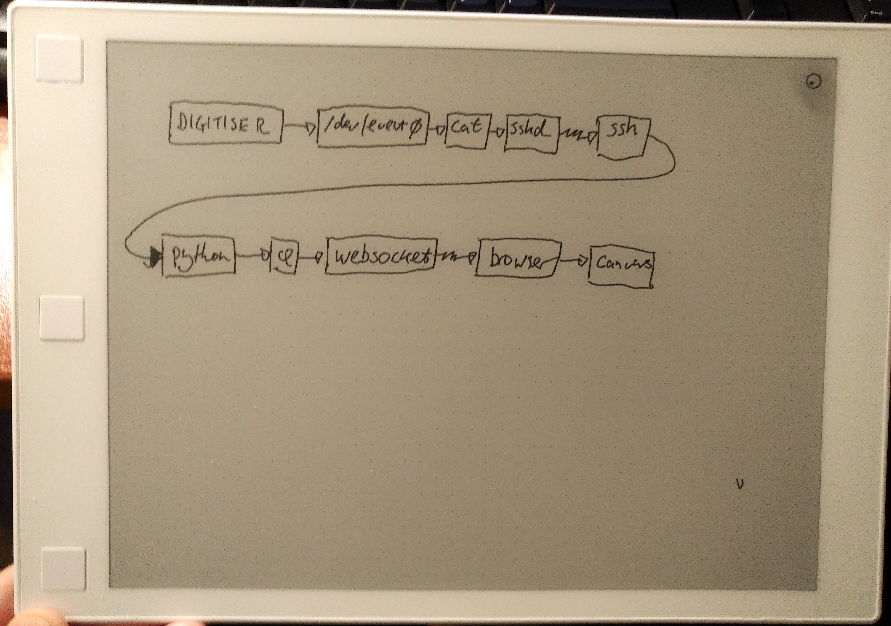
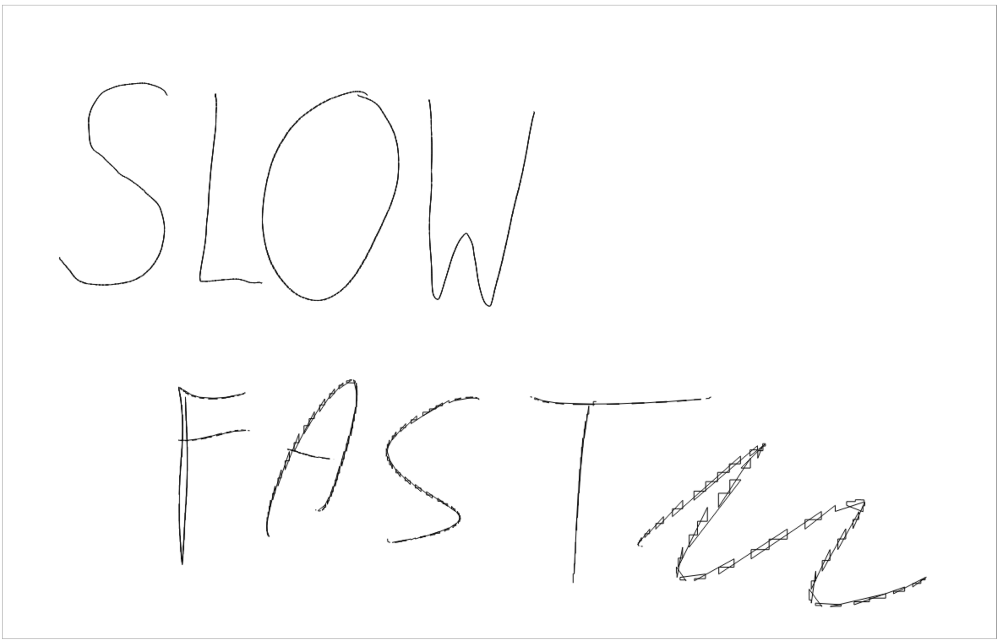

# Remarkable Tablet Canvas

Very simple tool to draw pen input to a browser window for sharing. Runs on the desktop, nothing to install on the ReMarkable.

Copies pen strokes, not the contents of the screen, but that's fine for live-sharing sketches.

Tested on a Mac, Linux probably works fine. Captures data via `ssh`.

## How to use

You'll need to do a little bit on the command-line. Assuming you have Python 3 installed.

Setup:

1. Set up SSH private keys and config so that running `ssh remarkable` succeeds. This works both via wifi and USB connection.
    -  If you want to connect via WiFi you will need to retrieve the IP address from the help screen.
    -  If you want to use it with the wired connection, use the IP address `10.11.99.1`.
2. Install the requirements for the python script that runs on your computer:
    - `pip3 install -r requirements.txt`

To run:

1. `./run`
2. Visit <http://localhost:6789/>

Press 'enter' to rotate the canvas. Press 'space' to clear the canvas.

## Why?

For quick whiteboarding screenshare. The other solutions didn't quite work for me. 

 - The official one requires an account so I never tried it. 
 - [reStream](https://github.com/rien/reStream) captures the framebuffer but in the latest ReMarkable firmware crawls, giving about 0.5 fps.
 - This requires no compilation or execution on the tablet.

And I wanted a little project. Part of the reason I bought this tablet was the ability to hack it.

## How does it work?

The Remarkable tablet has access to the binary event stream for its input sensors in `/dev/input/event0`. It also allows SSH access. This streams the sensor data over SSH, parses the binary stream and sends it over a websocket to a browser.

The browser has some rudimentary smoothing, plus hover indicator.

## Smoothing

The data from the digitiser seems to zig-zag. This is subtle at slow speeds, but quicker strokes really show it up.

So the data is smoothed in a small averaged ring-buffer. Press `d` in the browser to toggle debug data points.

## TODOs and limitations

This was a one-evening hack. But it's promising.

1. Not great at detecting failed connection to the device.
2. Can't detect closing the browser. So if you do that you'll have to to quit the script (ctrl-c) and start it again.
3. Proper axes and scaling.
4. Capture keys as well to clear screen.
5. Clear up mess of mixture of async and synchronous threaded code.
