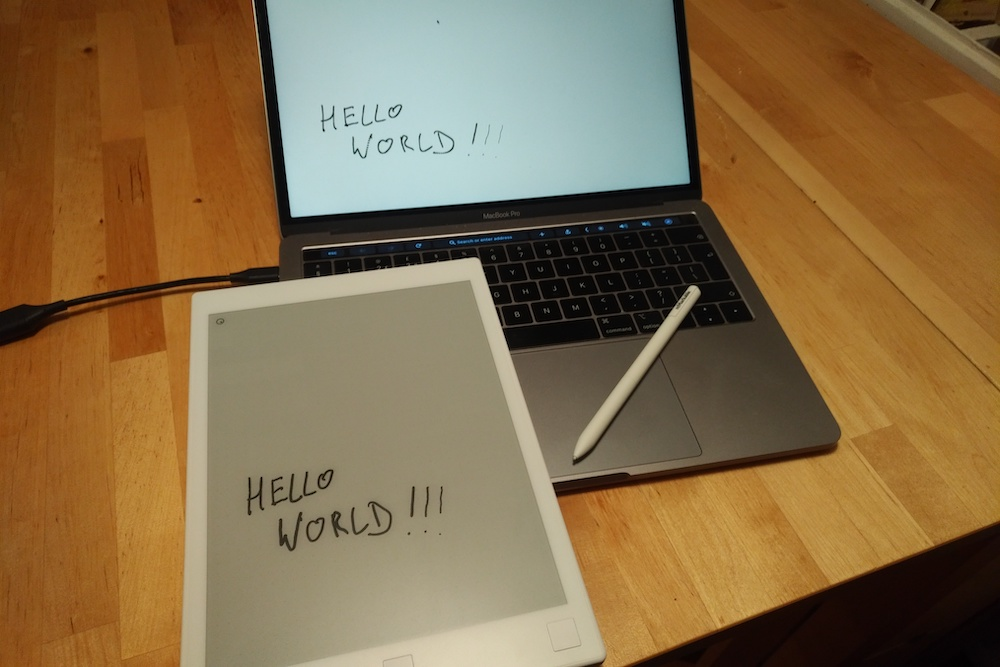

# Remarkable Tablet Canvas experiment

Experiment to reproduce the ReMarkable tablet screen on the desktop for white-boarding.

There are already screensharing solutions. The official one requires an account. [reStream](https://github.com/rien/reStream) captures the framebuffer but in the latest ReMarkable firmware crawls, giving about 0.5 fps.

The Remarkable tablet has access to the binary event stream for its input sensors in `/dev`. It also allows SSH access. Simple hack to stream this over SSH, parse the binary stream and send it over a websocket to a browser.

To run:
1. Install SSH keys so you can connect to the tablet with `ssh remarkable`.
2. `pip3 install websockets`
3. `pip3 install asyncio`
4. `python3 server-sync.py`
5. Visit `demo.html` in the browser.

# TODO

This was a one-evening hack. But it's promising.

1. Detect closed websocket to reuse browser sessions.
2. Interpolation?
3. Proper axes and scaling.
4. Capture keys as well to clear screen.
5. Serve HTML via http.
6. Clear up mess of mixture of async and synchronous threaded code.
