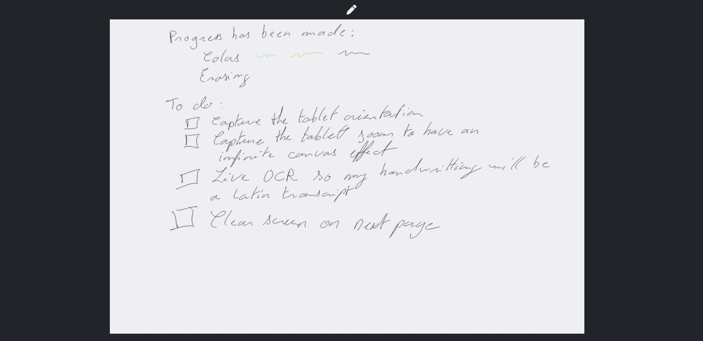

# Pipes and paper enhanced

This is the fork of the [pipes-and-paper experiment](https://gitlab.com/afandian/pipes-and-paper/-/tree/master) by Joe Wass.

This project aims to enable screen sharing between the ReMarkable tablet and a browser, without having an account on ReMarkable, nor having anything to install on the device itself, nor having the desktop app.

Copies pen strokes, not the contents of the screen, but that's fine for live-sharing sketches.

Support:

- Tested on Linux
- Mac works fine
- ReMarkable 2
- Might work for the ReMarkable 1 (untested)



## Features

- [x] Write with the stylus (contributions from [Joe Wass](https://gitlab.com/afandian))
- [x] Erase with the stylus (contributions from [Alex Riesen](https://gitlab.com/raalkml))
- [x] Change color (with <kbd>1</kbd> to <kbd>8</kbd>) (contributions from [Trevor Spiteri](https://gitlab.com/tspiteri))
- [x] Clear the screen with <kbd>space</kbd> (contributions from [Joe Wass](https://gitlab.com/afandian))
- [x] Presentation mode: a mode where writing and erasing is disable, but a pointer allows to highlight elements to the viewers. Use <kbd>P</kbd> to enter/leave this mode  (a feature made by [RedTartan04](https://github.com/RedTartan04))
- [x] Responsive interface

**Planned features**

- [ ] Capture next page on tablet to clear the screen (prerequirements WIP)
- [ ] Pages navigations on swipes left-right (browser should remember the drawings on the previous/next pages) (prerequirements WIP)
- [ ] In-Page navigation on swipes up-down (prerequirements WIP)
- [ ] Copy-paste, move, selection, etc. from the tablet
- [ ] Change canvas orientation according to the tablet portrait/landscape modes
- [ ] Capture zoom in/out to have kind-of infinite canvas
- [ ] Live OCR to transcribe latin handwriting to font

## Installation

Assuming you have Python 3 (at least `3.8.5`, previous versions are not supported) installed.

Setup:

1. [Set up SSH private keys and config](https://remarkablewiki.com/tech/ssh) so that running `ssh rem` succeeds. This works via USB connection.
2. Install the requirements for the python script that runs on your computer:

- Optional: set a virtual environnement `python3 -m venv .venv`
- Optional: activate the virtual environnement `source .venv/bin/activate`
- Install the project dependencies `pip3 install -r requirements.txt`

### For MacOS users

A convenience script that one can use as any other MacOS application can be found `rMwhiteboard.command`.

It provides the following advantages:

- behave like any MacOS app
- tries two hostnames until one is reachable (for a setup one in wifi, the other in usb)
- open automatically the browser with the proper address when the server is ready


Some customization might be required and are marked within the script by `#TODO`.

For it to work without modification, please follow this requirements:

- An SSH hostname named `rm2` and an alternate one `rm2usb`
- The repo has been cloned in `~/Develop/pipes-and-paper-enhanced`

## Usage

1. `./run.sh` with the following _optional_ options 

```
usage: main.py [-h] [-p PORT] [-s SSH_HOSTNAME] [--screen-debug]

Screen share in browser for ReMarkable tablets.

options:
  -h, --help            show this help message and exit
  -p PORT, --port PORT  The port to use to expose the website on localhost.
  -s SSH_HOSTNAME, --ssh-hostname SSH_HOSTNAME
                        The name of the ReMarkable SSH host.
  --screen-debug        Instead of running the web server, run in screen input debug mode.
```

2. Visit http://localhost:8001/


## Original motivation of Joe Wass

For quick white-boarding screenshare. The other solutions didn't quite work for me. 

 - The official one requires an account so I never tried it. 
 - [reStream](https://github.com/rien/reStream) captures the frame buffer but in the latest ReMarkable firmware crawls, giving about 0.5 fps.
 - This requires no compilation or execution on the tablet.

And I wanted a little project. Part of the reason I bought this tablet was the ability to hack it.

## How does it work?

The Remarkable tablet has access to the binary event stream for its input sensors in `/dev/input/event0`. It also allows SSH access. This streams the sensor data over SSH, parses the binary stream and sends it over a websocket to a browser.

The browser has some rudimentary smoothing, plus hover indicator.

## Contributors

- [Joe Wass](https://gitlab.com/afandian): original repo
- [Alex Riesen](https://gitlab.com/raalkml)
- [Trevor Spiteri](https://gitlab.com/tspiteri)
- [RedTartan04](https://github.com/RedTartan04)
